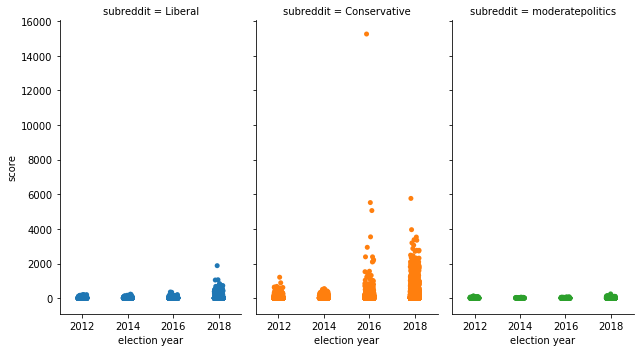
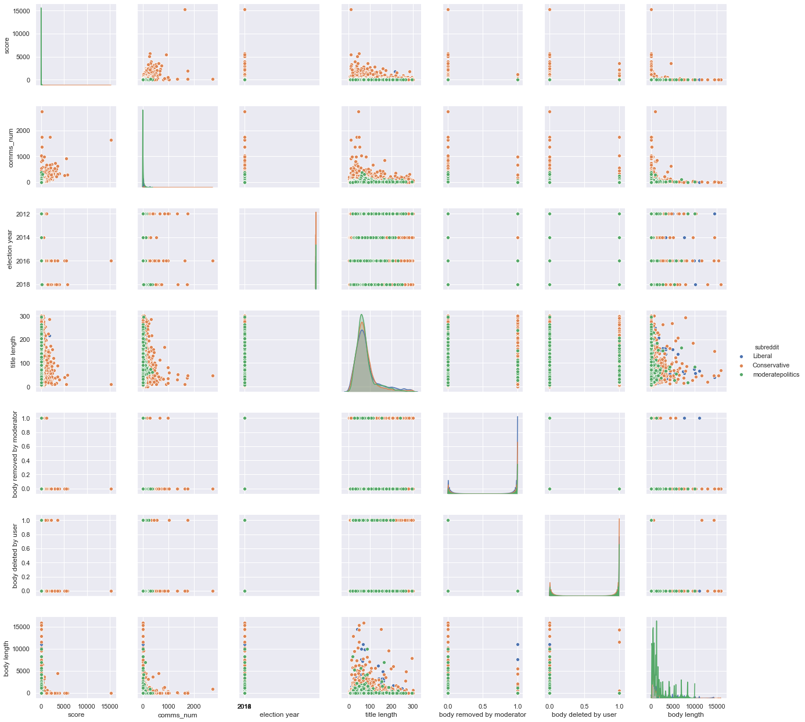
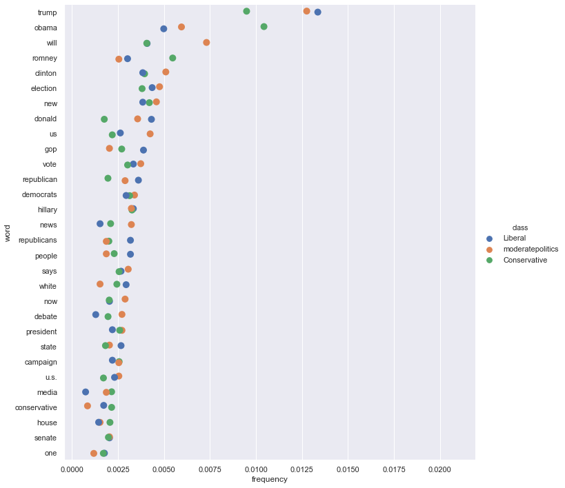
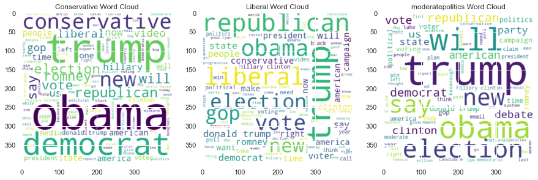

## CS 109
## Predicting Election Outcomes Using Reddit Posts & Tweets


```python

# import libraries
%matplotlib inline
import numpy as np
import scipy as sp
import matplotlib as mpl
import matplotlib.cm as cm
import matplotlib.pyplot as plt
import pandas as pd
import time
pd.set_option('display.width', 500)
pd.set_option('display.max_columns', 100)
pd.set_option('display.notebook_repr_html', True)
import seaborn as sns
import html
from bs4 import BeautifulSoup
import requests

```

This is the immage that is generated:








